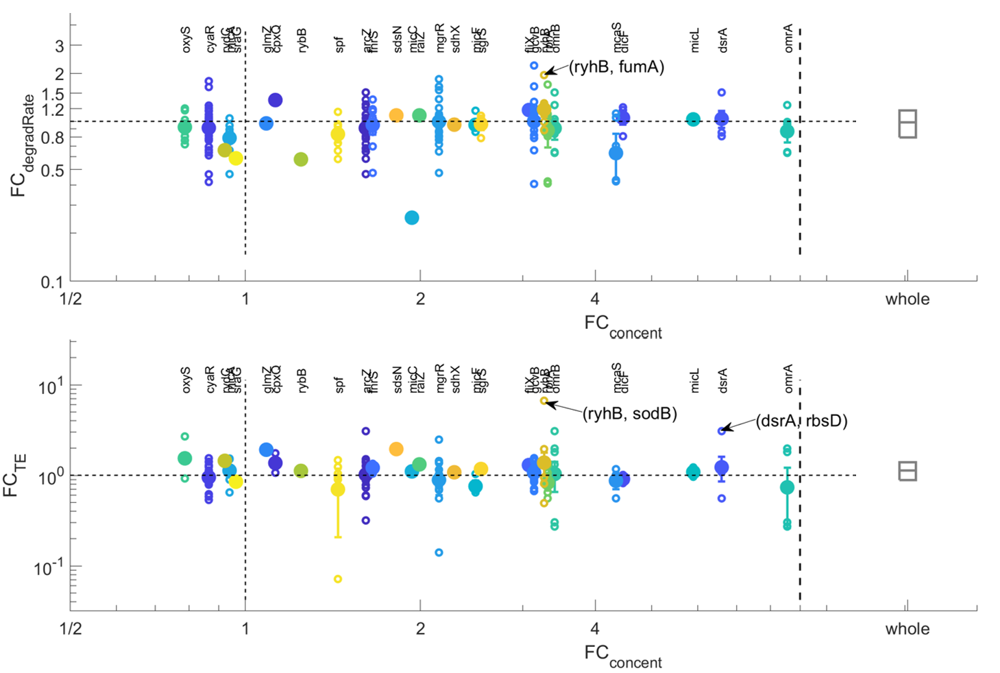
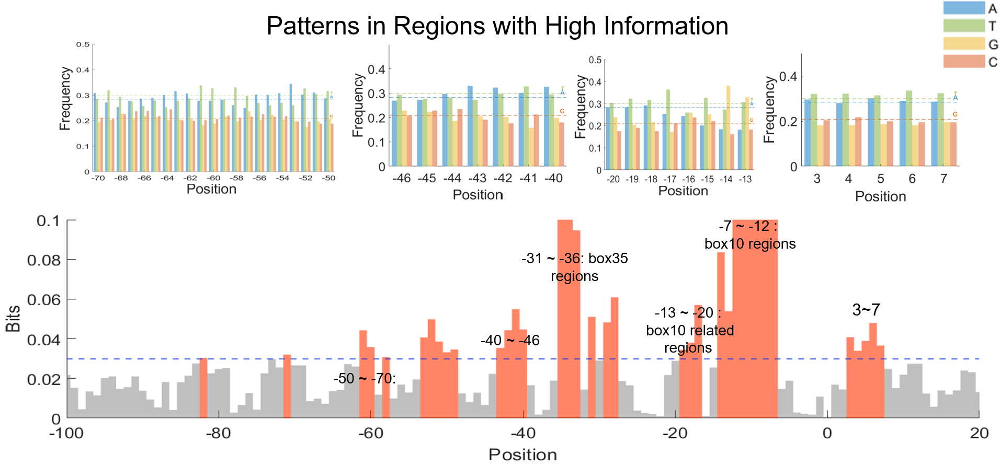
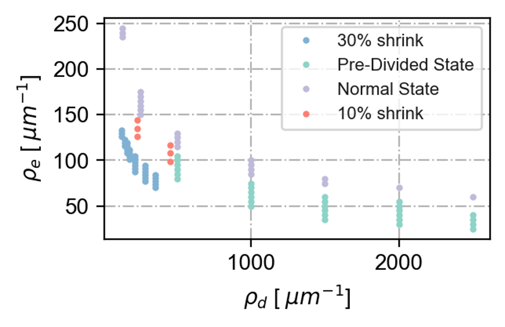

# About me
Hi! I am Xuan Ouyang (欧阳轩, pronounced as Shwan Oh-yang). I'm a senior in [Integrated Science Program](https://yuanpei.pku.edu.cn/en/education/interdisciplinarymajors/523215.htm) at [Peking University](https://english.pku.edu.cn/), under the supervision of [Jie Lin](https://cqb.pku.edu.cn/jlingroup/). I was an summer intern in [Terence Hwa](https://cqb.pku.edu.cn/jlingroup/)'s Lab at Department of Physics, U.C. San Diego. In addition, I will join [Daniel Lew](https://sites.google.com/view/lewlab/home)'s Lab from January to March 2024 as a research intern at Biology Department, MIT. I have broad research interests in quantatitve and system biology, genetics, and microbiology which originates from a rigorous integrative training offered by Intergrated Science Program, and broad research experiences at three extensive collaborative research institutes at Peking([CQB](https://cqb.pku.edu.cn/)), UCSD([Physical Biology](https://qbio.ucsd.edu/)) and MIT([Biology](https://biology.mit.edu/)).

# Selected Research

## Whole-genome sRNA-mediated gene expression regulations
Supervised by [Matteo Mori](https://scholar.google.it/citations?user=_4FUCVYAAAAJ&hl=it) and [Terence Hwa](https://scholar.google.it/citations?hl=it&user=L2SR_dkAAAAJ)

sRNA plays a central regulatory role in gene expression primarily by complementary binding to induce co-degradation or alter mRNA spatial conformation, affecting mRNA stability or translation ability. Below is the genome-wide sRNA-mediate gene expression map under carbon-limitation(by limiting the numbers of glucose transporters) condition.

< 

## Revealing the Relations between Promoter Sequences Patterns and Gene Expression Levels
Supervised by [Terence Hwa](https://scholar.google.it/citations?hl=it&user=L2SR_dkAAAAJ)

[Recent findings](https://www.science.org/doi/abs/10.1126/science.abk2066) underscore basal expression levels, dictated by corresponding promoter strength, primarily determine gene expression levels—quantified by protein abundance. The conservation of basal expression levels across diverse bacteria implies the feasibility of gene expression level prediction among species, provided their genomes are available. Below is the patterns revealed in near-promoter regions. I highlight the regions with high information.  0 here is the transcription start site. 

## Mechanism of Accurate Division in E. coli and its Response to Hyperosmotic Shock
Supervised by [Jie Lin](https://cqb.pku.edu.cn/jlingroup/)

Cells display internal temporal fluctuations and individual variations in size and protein content and face rapid and large changes in factors like osmolarity, temperature, and nutrients. However, the size variances are constrained within a specific, environment-influenced range, suggesting a precise and dynamic regulatory mechanism. Focusing on the MinCDE system, which positions the division machinery spatiotemporally and is crucial for effective division in E. coli, I investigated the division strategy and dynamic adjustment under osmotic shock.

